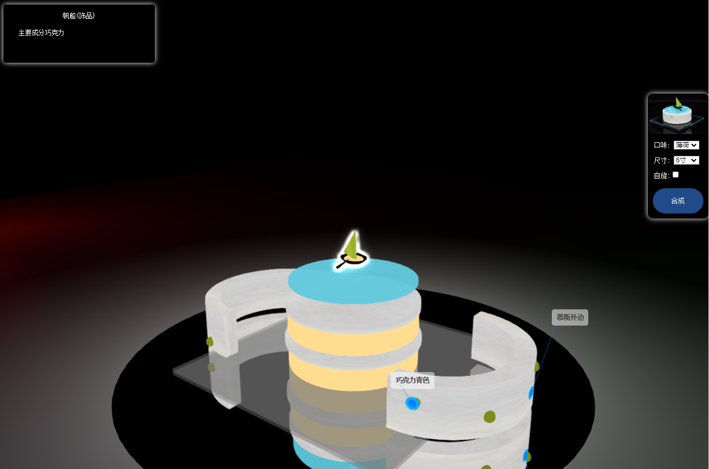
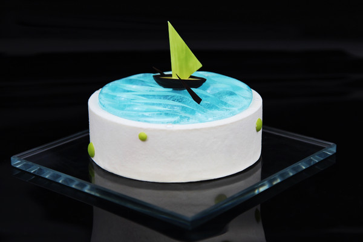
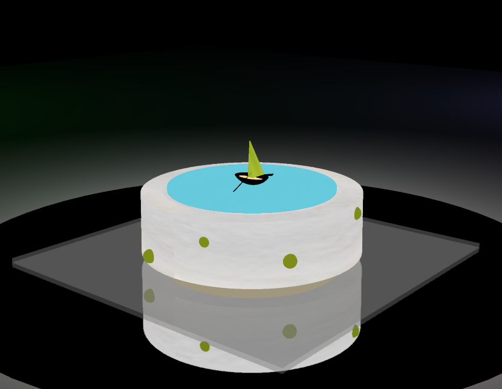

# vr-cake-demo

**这是一个基于Threejs的商品VR展示系统的 VR模型展示Demo**
- Demo界面示意图

- Demo蛋糕实物图片

- Demo蛋糕VR效果图

## 研究意义

2020年，已经进入了5G时代，许许多多的行业都得开启了高速发展模式，自动驾驶行业，人工智能行业，虚拟现实行业等曾经因受到网络传输，网络安全等的限制。如今“瓶颈”解除，发展迅速。虚拟现实技术早期多应用于3D游戏中，当前已经大量开始运用到互联网销售行业，例如：VR车展、VR看房、VR购物等，通过搭建展示商品的3D虚拟展示平台,让消费者或者用户能够从各种角度去浏览观察想要了解的商品的3D虚拟模型,还可以看到商品的内部信息,这些是一般情况下用户或者消费看不到的商品信息，并且还可以进行一些与商品之间的互动，给用户或者消费者更加全面的了解商品的新的体验或者说是新模式。这种模式已经成为了互联网销售行业发展的大趋势。当前的不少的公司都开始投入研究力量,建立了虚拟现实平台,并在平台上向售卖的对象或者平台的浏览者展示自家产品的虚拟模型和虚拟服务,给他们极大自由度和观察、了解的空间，甚至可以根据个人喜好，对商品在线进行个性化的定制，并且还能看到实时的定制效果，然后将个性化定制的信息传递给系统后台，商家或企业为消费者或者用户提供专属商品或服务。比起当前大多数企业或者商家依然还停留在文字描述商品，图片或视频等方式为主，缺乏立体感，缺乏交互性，难以让用户或消费者全面的了解商品，没有什么竞争优势。采用新的VR展示技术，可以让商品在同类商品中迅速出线，获得消费者或者用户的青睐。这必然会给企业或者商家带来明显的经济效果。

针对目前商品展示的现状，分析传统互联网销售的实际情况：

传统的互联网销售，因其的局限性，不全面，不可感，差异性较大，传统在网上去买东西，主要靠商家或者企业给消费者或者用户提供的图片或者视频，或者就是看商品的评价，看差评，看成交量，决定购买商品时，对商品的细节，大小尺寸等缺乏了解，最后导致效果不理想，不合适，与实物的展示效果不符，也就是网络流行的“买家秀”和“买家秀”等，然后消费者选择退货，此次交易失败，浪费大量的资源、精力和宝贵的时间。而虚拟现实技术有着三维立体可视化实时交互的特性，把商品1：1原样“复制”到一个虚拟的三维空间，将商品全面的展示给用户或者消费者，在商品展示这一方面有天然的优势可以无缝结合互联网,可以给互联网销售带来许多新的特性，把商家和消费者借助互联网这张“大网”连接起来,让商品交易突破了传统的时间、空间限制，给消费者极大的自由度和个性化的需求，便于商品的交易，提升购物体验，刺激消费，带动经济的发展。

考虑当前市场形式，利用虚拟现实技术理论，结合计算机网络、交互设计实现一个以普通电脑或手机浏览器为载体的适用于用户或消费者需求的VR展示平台系统，打造一种全新的商品展示方式，使得用户或者消费者的购物体验得到大大优化和提高，全面的了解商品，刺激消费，保证交易的成功率。

## 项目成果

**在VR商品展示中能够任意的改变观察的角度，视点的距离，将商品模型进行分解展示，更好地了解和认识想要了解的商品信息和特征，并且可以对商品模型进行一定的修改，满足不同顾客的不同个性化需求。主要分为商品展示、模型交互展示和模型自定义。**

更多相关信息 可通过这篇文章进一步了解 [基于threejs的商品VR展示平台的设计与实现思路](https://fivecc.blog.csdn.net/article/details/125626101)

## 相关运用

### 实际运用视频展示

[three.js VR模型制作演示](//player.bilibili.com/player.html?aid=513009253&bvid=BV1A3411A7Rr&cid=764773931&page=1)

